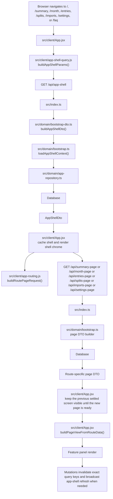

# App Shell Flow

This document traces the first-load and follow-up query flow after the shell
refactor. The goal is to show which files participate, which API endpoints are
called, and what each stage returns.

## Flowchart

## Stage Breakdown

| Stage | File(s) | API call | Output |
| --- | --- | --- | --- |
| Route parse | `src/client/App.jsx` | none | Active tab, selected view, month, scope, and summary range |
| Shell key build | `src/client/app-shell-query.js` | none | Stable app-shell cache key and optional persisted shell payload |
| Shell request | `src/client/App.jsx`, `src/index.ts`, `src/domain/bootstrap-dto.ts`, `src/domain/bootstrap.ts` | `GET /api/app-shell` | `AppShellDto` with household, accounts, categories, tracked months, and viewer identity fields |
| Route request build | `src/client/app-routing.js` | none | Exact route page endpoint and query params for the current tab |
| Page request | `src/client/App.jsx`, `src/index.ts`, `src/domain/bootstrap.ts` | `GET /api/summary-page`, `GET /api/month-page`, `GET /api/entries-page`, `GET /api/splits-page`, `GET /api/imports-page`, or `GET /api/settings-page` | Page-specific DTO for the active screen |
| Continuity bridge | `src/client/App.jsx` | none | Keep the last settled screen visible while the next route hydrates without turning that snapshot into a competing source of truth |
| View shaping | `src/client/App.jsx` | none | Minimal view object for the current panel |
| Mutation refresh | `src/client/App.jsx`, `src/client/query-keys.js`, `src/client/app-sync.js` | mutation endpoint plus sync event | Exact cache invalidation and optional shell refresh broadcast |

## Practical Notes

- `src/client/App.jsx` is an orchestrator, not a hidden page service.
- shell and route-page requests can overlap when the route page does not need
  shell-derived inputs to begin safely.
- `src/domain/bootstrap.ts` owns the lower-level data loading and page DTO
  builders.
- `src/domain/bootstrap-dto.ts` owns the shell DTO constructors.
- the last settled screen is retained only as a hydration fallback; the active
  route still comes from TanStack and the browser location.
- The removed legacy all-in-one bootstrap route is intentionally not part of
  this flow.

## Route Affordance

The route affordance is the small pending-state marker that appears inside the
routed panel while a new page is still hydrating. Think of it like a seatbelt
light in a car: it warns that the next state is still settling, but it does not
turn off the whole dashboard.

In practice, the route affordance should behave like:

- a slim placeholder inside the active panel area
- a loading badge on a tab strip, not a blank app shell
- the paper cover on a book chapter, not the whole library being closed

It should not behave like:

- a full-screen startup wall
- a global reset of shell chrome
- a destructive replacement of the previous settled screen
