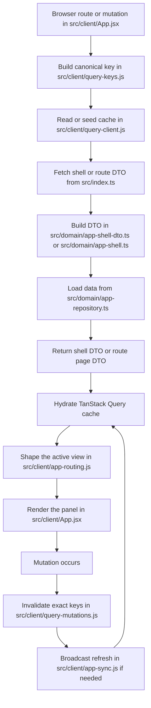

# TanStack Query Language

This document defines the query design language for Monies Map. It describes
how the client names queries, how each slice owns its own data, how invalidation
works, and how the shell stays narrow while the active route fetches the rest.

Read this alongside:

- [`docs/query-map.md`](./query-map.md)
- [`docs/app-shell-flow.md`](./app-shell-flow.md)
- [`docs/code-spec.md`](./code-spec.md)
- [`docs/existing-behavior-guardrails.md`](./existing-behavior-guardrails.md)

## Design Goals

- Keep server-state ownership close to the screen that consumes it.
- Make cache identity deterministic and route-derived.
- Keep the app shell narrow and durable.
- Invalidate exactly the keys that a mutation affects.
- Allow background refreshes without breaking the visible workflow.
- Prefer prefetch over broad bootstrap payloads.

## Vocabulary

### Query identity

The query key is the contract. A query is considered the same only when its
normalized key is the same.

### Query ownership

Each screen owns the data it needs to render. Shared shell data belongs to the
app shell query. Route-specific data belongs to the route page query.

### Exact invalidation

Mutations clear the specific cache keys they affect, not broad buckets. That is
the default rule unless a workflow explicitly needs a wider refresh.

### Background refresh

The app may refetch in the background, but it should not tear down the current
workflow or replace active drafts unless the user has completed that workflow.

### Prefetch

Prefetch is a hint, not a source of truth. It is used only for likely next
navigation, not as a replacement for the active route request.

## Query Classes

### Class A: Shell and reference data

Examples:

- app shell
- household metadata
- accounts
- categories
- tracked months

Rules:

- long cache window
- explicit invalidation only
- persistence is allowed when the cache key still matches the route state

### Class B: Route-owned page data

Examples:

- summary page
- month page
- entries page
- splits page
- imports page
- settings page

Rules:

- fetch after the shell exists
- route params define the cache key
- screen-specific refreshes stay on the screen that owns them

### Class C: Mutation-sensitive workflow data

Examples:

- import preview
- entry edit state
- month edit state
- split mutation targets

Rules:

- invalidate immediately after the save
- only refetch what the mutation actually changed
- do not let a freshness burst destroy an active draft

## Implementation Files

- [`src/client/query-keys.js`](../src/client/query-keys.js) defines the
  canonical cache keys and normalizes their params.
- [`src/client/query-client.js`](../src/client/query-client.js) sets cache
  windows and the default retry policy.
- [`src/client/query-mutations.js`](../src/client/query-mutations.js) owns the
  exact invalidation helpers.
- [`src/client/app-shell-query.js`](../src/client/app-shell-query.js) owns the
  shell query params and persisted shell cache.
- [`src/client/app-routing.js`](../src/client/app-routing.js) maps route state
  to page requests and view models.
- [`src/client/App.jsx`](../src/client/App.jsx) orchestrates shell loading,
  route-page loading, background refresh, and route-specific prefetch.
- [`src/index.ts`](../src/index.ts) serves the API routes that back the shell
  and page queries.

## Flow

## Rules

1. Query keys must be deterministic and normalized.
2. Shell data must not quietly grow into a hidden bootstrap payload.
3. Route pages own their own payloads and should not depend on other screens to
   hydrate them.
4. Mutations must invalidate the smallest correct set of keys.
5. If a refresh needs to happen in the background, it should not force the user
   out of the active workflow.
6. Prefetch is allowed only when there is a likely next route or screen.

## Current Conventions

- App shell uses `queryKeys.appShell(...)`.
- Route pages use `queryKeys.routePage(...)`.
- Entries use `queryKeys.entriesPage(...)`.
- Summary/month pages use their own route-derived keys.
- Persisted shell data is stored only when the cache key still matches the
  current shell request.
- The shell refresh broadcast is explicit and narrow.

## What This Language Rejects

- Broad bootstrap payloads that mix unrelated screens together.
- Hidden compatibility fallbacks that survive after the new path is tested.
- Shared invalidation that removes unrelated pages.
- Route fetches that depend on unrelated UI state.
- Long-lived derived state that can be recalculated from the route and the
  server response.
